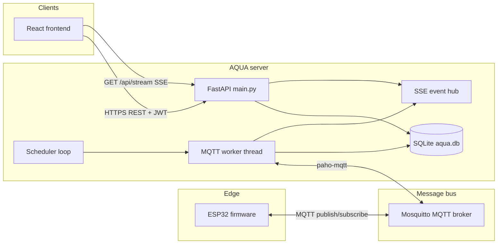

# AQUA — Application & architecture

This document describes the **Aquarium Automation Platform** (AQUA): what it does, how the pieces fit together, and how data flows between the ESP32 controller, MQTT broker, backend, and web UI.

---

## 1. Purpose

AQUA is a **local-first aquarium automation stack** that:

- Ingests **sensor telemetry** (temperature, light, water level, heater/LED state, etc.) from one or more **ESP32** devices over **MQTT**.
- Stores history in **SQLite** and exposes a **REST API** for dashboards and automation.
- Sends **commands** (heater, LED, optional filter bridge) to devices with **correlation IDs** and **ack** tracking.
- Provides a **single-page web app** (React + Vite) for monitoring, device management, schedules (dawn/dusk LED curves), and settings.
- Streams **live updates** to the browser via **Server-Sent Events (SSE)** when telemetry, commands, or MQTT events occur.

The backend is implemented in **Python** (**FastAPI**). Devices use **MQTT** (typically **Mosquitto**) as the shared message bus between firmware and server.

---

## 2. High-level architecture



**Roles:**

| Piece | Role |
|--------|------|
| **ESP32** | Reads sensors, drives heater relay and PWM LED, publishes telemetry (~1 Hz), subscribes to command topics, publishes acks and status. |
| **Mosquitto** | Routes topics under a configurable root (default `aqua`). Backend and devices are peers on the broker. |
| **FastAPI** | HTTP API, static SPA, auth, orchestration of commands and schedules. |
| **MQTT worker** | Dedicated thread: subscribes to `telemetry`, `status`, `ack/#`; persists data; emits SSE events; publishes outbound commands. |
| **SQLite** | Devices, telemetry rows, commands, acks, schedules, users, optional filter state. |
| **Scheduler** | Periodic tick (with MQTT worker) to apply **dawn/dusk** (and related) LED schedules per device. |
| **Frontend** | Dashboard, compare charts, settings (including MQTT broker info for display), scenarios/schedules, login. |

---

## 3. MQTT topic model

Default topic root: **`aqua`** (configurable via `settings.json` / `MqttSettings.topic_root`).

| Direction | Topic pattern | Purpose |
|-----------|----------------|--------|
| Device → cloud | `{root}/{device_id}/telemetry` | JSON telemetry (`device_id`, `ip` required; metrics optional). |
| Device → cloud | `{root}/{device_id}/status` | Retained online/offline style payloads; LWT may publish offline. |
| Cloud → device | `{root}/{device_id}/cmd/heater` | Heater command (JSON with `action`, optional `correlation_id`). |
| Cloud → device | `{root}/{device_id}/cmd/led` | LED command (`on`/`off`/`toggle`/`set_brightness`, etc.). |
| Cloud → device | `{root}/{device_id}/cmd/filter` | Optional filter commands (if backend/feature enabled). |
| Device → cloud | `{root}/{device_id}/ack/heater` | Ack with state + `correlation_id` when applicable. |
| Device → cloud | `{root}/{device_id}/ack/led` | Same for LED. |

The **backend** MQTT client (separate from devices) subscribes to:

- `{root}/+/telemetry`
- `{root}/+/status` (for validation / device online tracking where implemented)
- `{root}/+/ack/#`

It publishes commands to `{root}/{device_id}/cmd/{component}` with QoS and records pending commands until an ack or timeout.

---

## 4. Backend modules

| Module | Responsibility |
|--------|----------------|
| **`main.py`** | FastAPI app: routes for health, auth, users, devices, telemetry queries, commands, MQTT settings, schedules, SSE stream, filter endpoints; lifespan startup/shutdown of MQTT worker and background tasks. |
| **`mqtt_worker.py`** | Paho MQTT client on a **background thread**; ingest telemetry/status/acks; `publish_command()` for UI/scheduler; connection state for `/mqtt/connection`. |
| **`database.py`** | SQLite schema, migrations, CRUD for devices, telemetry, commands, acks, schedules, telemetry retention. |
| **`config.py`** | Load/save `settings.json` (`AppConfig`: MQTT, logging retention, auth); env overrides (`AQUA_*`). |
| **`auth.py`** | Password hashing, JWT create/verify for API + optional user registration. |
| **`events.py`** | In-memory pub/sub queues for **SSE**; `emit_event()` from MQTT callbacks and API. |
| **`scheduler.py`** | Dawn/dusk (and curve) logic; calls `mqtt_worker.publish_command` for LED brightness on a tick. |

**Background tasks** (asyncio) in `main.py` typically include command timeout checking (stale commands → TIMEOUT) and housekeeping (e.g. log retention).

---

## 5. Data flow

### 5.1 Telemetry (device → UI / DB)

1. ESP32 publishes JSON to `aqua/{device_id}/telemetry`.
2. MQTT worker receives message, validates minimal keys (`device_id`, `ip`), upserts device metadata, inserts telemetry row, emits SSE `telemetry`.
3. Frontend polls or listens on SSE to refresh charts and cards.

### 5.2 Commands (UI → device)

1. Client `POST /api/devices/{device_id}/commands/heater|led` (JWT).
2. API generates `correlation_id`, stores command row, calls `mqtt_worker.publish_command(...)`.
3. Device executes, publishes ack on `.../ack/heater` or `.../ack/led`.
4. Worker matches ack to command, updates DB, emits `command_ack` / related SSE events.

### 5.3 Schedules (server → device)

1. User defines a schedule (dawn/dusk times, brightness, days) via API; stored in DB.
2. Scheduler runs on an interval, computes target LED brightness, publishes MQTT `set_brightness` (or equivalent) via the same command path.

---

## 6. Frontend

- **Build:** Vite + React + TypeScript; output served from `frontend/dist` as static files under the FastAPI app.
- **Auth:** JWT stored client-side; login/register flows against `/api/auth/*`.
- **Live data:** `useSSE` or similar hooks subscribe to `/api/stream` for real-time telemetry/command events where implemented.
- **Main areas:** Dashboard (per-room or device views), telemetry history, **Compare** (multi-device charts), **Settings** (devices, MQTT connection info), **Scenarios** (schedules), optional **Filter** panel if enabled.

API base path is typically `/api` (see `main.py` router prefix).

---

## 7. Configuration & deployment

- **Config file:** `settings.json` under `AQUA_DATA_DIR` (default: same directory as the app), merged with environment variables for Docker/production.
- **Database file:** `aqua.db` in the same data directory.
- **MQTT:** `broker_host`, `broker_port`, optional TLS (`use_tls`, `ca_certs`), `topic_root`, timeouts, QoS.
- **Container:** Common pattern is API + Mosquitto + reverse proxy; broker hostname may default to `mosquitto` on Docker networks (see `config.py`).

---

## 8. ESP32 firmware (reference)

Firmware is maintained outside this repo (e.g. Arduino sketch under `filtr/aquarium_controller` or `aqua 2.0`). Conceptually it:

- Connects to Wi-Fi and MQTT with a **unique client id** (e.g. MAC-based) to avoid broker session clashes.
- Publishes **telemetry** at a fixed interval (e.g. 1 s) and **retained online** status; uses **LWT** for offline indication when supported.
- Subscribes to heater/LED command topics and publishes **acks** in the JSON shape expected by the backend.

Hardware details, compile flags (`ENABLE_BH1750`, `ENABLE_OLED`, etc.), and pinout are documented in **`docs/ESP32.md`** in this repository.

---

## 9. MQTT payload examples (contract)

Use these shapes to avoid backend/firmware drift. Topic root below is `aqua`; replace `{device_id}` with your device (e.g. `esp32-01`).

### 9.1 Telemetry — `aqua/{device_id}/telemetry` (QoS per config, not retained)

**Minimum required by the worker** (`mqtt_worker.validate_telemetry`): every message must include **`device_id`** and **`ip`** (string). All other fields are optional but stored when present.

Example (aquarium controller):

```json
{
  "device_id": "esp32-01",
  "ip": "192.168.0.137",
  "uptime_ms": 1234567,
  "temp": 24.5,
  "lux": 120.0,
  "water": true,
  "water_voltage": 2.1,
  "heater": false,
  "led": true,
  "led_brightness": 80,
  "button_pressed": false,
  "button_voltage": 0.5
}
```

Example (room sensor style — humidity, no lux/heater):

```json
{
  "device_id": "room-01",
  "ip": "192.168.0.50",
  "temp": 22.1,
  "humidity": 45.0
}
```

### 9.2 Device status — `aqua/{device_id}/status` (often retained)

Backend validates `status` ∈ `online` | `offline` and normalizes device row. Typical **online** publish from firmware:

```json
{
  "status": "online",
  "source": "esp32",
  "device_id": "esp32-01",
  "ip": "192.168.0.137",
  "uptime_ms": 1234567
}
```

**Last Will** (example) on disconnect:

```json
{
  "status": "offline",
  "source": "esp32",
  "device_id": "esp32-01"
}
```

### 9.3 Command — `aqua/{device_id}/cmd/heater` or `.../cmd/led`

Published by the backend with **`retain=false`**. Shape:

```json
{
  "action": "on",
  "correlation_id": "550e8400-e29b-41d4-a716-446655440000",
  "source": "ui",
  "ts": "2026-03-27T12:00:00+00:00",
  "payload": { "value": 75 }
}
```

- `source` is `ui`, `scheduler`, etc.
- For LED `set_brightness`, brightness is usually under `payload.value` (0–100 or 0–255 per firmware normalization).

### 9.4 Ack — `aqua/{device_id}/ack/heater` or `.../ack/led`

```json
{
  "heater": true,
  "source": "mqtt_cmd",
  "device_id": "esp32-01",
  "ip": "192.168.0.137",
  "uptime_ms": 1234999,
  "correlation_id": "550e8400-e29b-41d4-a716-446655440000"
}
```

```json
{
  "led": true,
  "brightness": 80,
  "source": "mqtt_cmd",
  "device_id": "esp32-01",
  "ip": "192.168.0.137",
  "uptime_ms": 1234999,
  "correlation_id": "550e8400-e29b-41d4-a716-446655440000"
}
```

### 9.5 Backend process status (separate topic)

The server publishes its own liveness to **`aqua/backend/status`** (retained): `online` on connect, LWT `offline` — distinct from per-device topics.

---

## 10. Device identity, presence, and last-seen

### 10.1 `device_id`

- **Canonical id** is the **second segment** of MQTT topics: `aqua/{device_id}/...`.
- It must match the **`device_id`** field inside telemetry payloads (the worker also injects from the topic if missing).
- The API and dashboard refer to the same string (e.g. `esp32-01`). Register devices via `/api/devices` so names/metadata align.

### 10.2 Presence rules (as implemented)

| Signal | Effect on `devices` row |
|--------|-------------------------|
| **Telemetry** accepted | `online = 1`, `last_seen_ts` updated to now, `last_ip` updated from payload. |
| **Status** `online` | `online = 1`, `last_status_ts` updated; `last_seen_ts` only filled if it was previously null (does not replace a known last-seen). |
| **Status** `offline` | `online = 0`; `last_status_ts` updated. |

So **liveness in the UI is primarily driven by telemetry** for “last heard from device.” Status/LWT complements explicit offline.

### 10.3 Retained messages

- **Commands** are always published with **`retain=false`** (devices must be subscribed when a command is sent; no “sticky” command on broker).
- **Device online** status may be published **retained** by firmware so new subscribers see last known state.
- **Backend** publishes **retained** `aqua/backend/status` for process health.

### 10.4 `device_online` in code

`db.device_online(device_id)` is **`devices.online == 1`**. The scheduler **skips** devices that are not online. The HTTP command handlers **still enqueue MQTT publishes when offline** (they log a warning and return `device_offline: true` in the JSON response) unless the MQTT client itself is down (see §13).

---

## 11. Commands: manual UI vs scheduler (conflict behavior)

- **No server-side mutex** between the UI and the scheduler: both call `mqtt_worker.publish_command()` with a **new UUID** `correlation_id` each time.
- **Order on the wire** is **FIFO per broker**; the **device applies messages in arrival order**. Rapid alternating UI and scheduler updates can produce **last-message-wins** behavior on the LED.
- **Scheduler** (`scheduler.run_dawn_dusk_tick`): only runs if **`mqtt_worker.connected`** and **`db.device_online(device_id)`** and the schedule is enabled. It sends `led` / `set_brightness` with `source="scheduler"`.
- **UI** commands use `source="ui"` (or similar). Firmware may use `source` for logging only.
- **Determinism:** To make behavior predictable operationally: avoid overlapping aggressive schedule steps with manual control, or extend firmware to **ignore scheduler** when a user “manual override” flag is set (not implemented in backend today — would be a product rule in firmware).

### 11.1 Command lifecycle and timeouts

1. Command inserted with status **`SENT`**.
2. Matching ack with same **`correlation_id`** → **`ACKED`**.
3. If no ack within **`command_timeout_seconds`** (default **5 s**, configurable), background task marks stale **`SENT`** commands as **`TIMEOUT`**.

---

## 12. Telemetry persistence and retention (SQLite)

### 12.1 What gets stored

- Each accepted telemetry message inserts one row in **`telemetry`** (time-series columns + full JSON in `raw`).
- **Devices** table holds latest metadata and online bit.

### 12.2 Retention

- Config: **`logging.retain_days`** in `settings.json` (default **30**).
- **`0`** = **never delete** old telemetry (database can grow without bound — plan disk and backups).
- **`> 0`** = periodic housekeeping **deletes rows** with `ts` older than N days (`database.purge_old_telemetry`).

### 12.3 Scaling notes

- SQLite is appropriate for single-node, moderate write rates (typical: one row per device per second). For many devices or sub-second history, plan **partitioning**, **external TSDB**, or **lower publish rates**.
- Indexes exist on `(device_id, ts)` for queries; very large DBs benefit from **VACUUM** maintenance and monitoring file size on `AQUA_DATA_DIR`.

---

## 13. Failure behavior

### 13.1 MQTT broker unreachable or backend MQTT client disconnected

- **`mqtt_worker.publish_command`** raises **`RuntimeError`** → API returns **503** (“MQTT client not connected”). Commands are **not** queued to disk for later.
- Ingest of telemetry/acks **stops** until the worker reconnects.
- **SSE** still works for API-origin events; device-originated events resume after reconnect.

### 13.2 Device offline (DB `online=0`)

- **Scheduler** does **not** send LED commands to that device.
- **HTTP commands** still **attempt** MQTT publish (with **`device_offline: true`** in response); the message may never be consumed if the device is actually disconnected — expect **timeouts** on pending commands.

### 13.3 Database errors

- MQTT callback handlers wrap processing in **try/except**; failures are logged. A bad row should not crash the whole worker, but **that message may be dropped** from persistence.

### 13.4 Invalid JSON or missing required telemetry keys

- Non-JSON payloads on subscribed topics are **skipped**.
- Telemetry without **`device_id` + `ip`** is **rejected** by `validate_telemetry` (warning logged, no DB insert).

### 13.5 ESP32 / LAN failure

- From the device perspective: reconnect logic, LWT, and retained status are **firmware responsibilities** (see **`docs/ESP32.md`**).

---

## 14. Security notes

- API routes for devices, telemetry, and commands require **authentication** (JWT) except documented public endpoints (e.g. health, static assets policy as configured).
- MQTT credentials for the **backend** are stored in settings; devices use their own broker user/password or anonymous mode depending on Mosquitto configuration.
- For internet-facing MQTT, use **TLS (MQTTs)** and proper certificates; `config.py` supports TLS-related fields and env overrides.

---

## 15. Related documents

| Document | Content |
|----------|---------|
| **`docs/ESP32.md`** | Libraries, Wi-Fi/MQTT configuration, hardware checklist for the controller. |
| **`frontend/README`** or package scripts | Build and dev commands for the UI. |

---

*This architecture reflects the Backend 3.0 codebase layout. When adding features, keep MQTT topic conventions and `device_id` consistency between firmware, broker ACLs, and API routes.*
